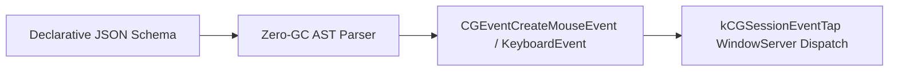

# MacroMac — macOS HID Architecture Specification

## 1. CoreGraphics Event Tap Pipeline
Posts hardware-level keyboard and mouse events directly to `kCGSessionEventTap`:

## 2. Dual Authorship
- **Жирняк (Jirnyak)** — macOS Core Systems & HID Intercept.
- **Адольф Петушков (Adolf Petushkov)** — Systems Architecture.
