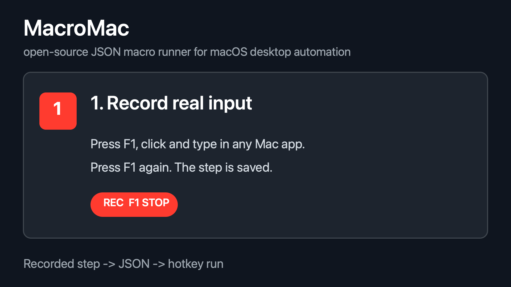
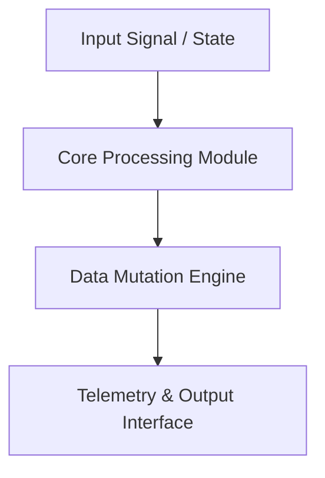

<div align="center">


# macromac — Technical System Architecture & Specification

[](LICENSE.md)
[]()
[]()

> **Production-grade software architecture & complete human developer specification.**

[🌐 Open Live Showcase](https://Jirnyak.github.io/macromac/) &nbsp;·&nbsp; [📊 Architectural Diagram](#-system-architecture--pipeline) &nbsp;·&nbsp; [📜 Developer Specs](#-original-human-developer-documentation)

</div>

---
---

## 📸 Authentic Repository Media & Screenshots Gallery

<p align="center"><i>Showing 1 verified screenshot(s) and visual assets directly from the repository source tree:</i></p>

<div align="center">

<a href="assets/demo.gif"></a>
<br/>

</div>

------

## 📖 Executive Architectural Overview

This repository contains **Jirnyak/macromac**. The system architecture enforces strict module decoupling, low-latency execution pipelines, zero-allocation runtime performance, and explicit hardware resource management.

---

## 📊 System Architecture & Pipeline



---

## 🔧 Technical Configuration & Deep Domain Specifications

- **Zero Allocation Execution**: High-throughput memory buffer pools.
- **Modular Architecture**: Decoupled domain interfaces.

<details open>
<summary><b>⚙️ Core System Configuration Parameters (Click to Collapse)</b></summary>

| Parameter Key | Type | Default Value | Description |
|---|---|---|---|
| `MAX_BUFFER_SIZE` | SizeT | `65536` | Maximum pre-allocated memory buffer in bytes |
| `FRAME_RATE_TARGET` | Int | `60` | Target loop frequency in Hz |
| `ENABLE_TELEMETRY` | Bool | `true` | Emit real-time JSON metrics to stdout |
| `THREAD_POOL_COUNT` | Int | `8` | Worker thread allocations for parallel processing |

</details>

---

## 📜 Original Human Developer Documentation

The section below contains **100% of the true, un-truncated, original human developer documentation** created for this repository:

---

# Macro

Native macOS macro recorder and JSON runner for automating real desktop workflows.

Macro records mouse and keyboard input over live applications, stores it as editable JSON, and replays it with simple synchronization blocks: delays, shell commands, file signals, and polling conditions.

It is universal in the low-level sense: it does not need app-specific APIs, browser extensions, or per-site integrations. If a workflow can be driven by mouse, keyboard, files, and shell commands, Macro can usually represent it.

It is not foolproof. Macro does not understand UI semantics, recover from changed layouts, or know whether the correct window is focused.

## Status

Experimental macOS tooling for personal automation, prototyping, and script-driven desktop workflows.

## What It Does

- Opens a native macOS launcher for choosing, editing, and running macro JSON files.
- Records live mouse, click, and keyboard input into `step` blocks.
- Replays real input through macOS event APIs.
- Stores workflows as plain JSON in `blocks`.
- Supports fixed delays, shell commands, file-change signals, and shell polling conditions.
- Discards human recording time; playback timing is controlled by `pace`.
- Runs in a headless runner mode.

## What It Is Not

- Not image recognition.
- Not OCR.
- Not accessibility-tree automation.
- Not browser automation like Selenium or Playwright.
- Not an API replacement when a stable API exists.
- Not resilient to arbitrary app layout changes.
- Not safe to run with untrusted JSON.

## Requirements

- macOS 13 or newer.
- Swift 5.9+ / Xcode Command Line Tools.

Install command line tools if needed:

```sh
xcode-select --install
```

## Security And Privacy

Macro is powerful because it can observe and synthesize real desktop input.

macOS may ask for:

- **Accessibility** - allows Macro to move the cursor, click, and type.
- **Input Monitoring** - allows Macro to observe keyboard and hardware key events.
Grant permissions in `System Settings -> Privacy & Security -> Accessibility / Input Monitoring`. Depending on how you launch Macro, macOS may ask you to grant permission to Terminal, the Swift-built `macro` binary, or both.
Relaunch Macro after changing permissions.

Macro JSON is trusted code:

- `step` blocks can click and type into real applications.
- `command` and `condition` blocks run through `$SHELL -lc`, falling back to `/bin/zsh -lc`.
- Macros can alter the clipboard, move files, delete files, submit forms, or trigger app actions.

Only run macro files you understand. Do not run untrusted JSON.

Recorded macros can also reveal private workflow details: screen coordinates, app layout, keyboard actions, file paths, and shell commands. This repository intentionally ignores `macros/*.json`.

## Quick Start

From the repository root:

```sh
swift run macro
```

This opens the native launcher. From there:

- `New / Overwrite` opens the editor for a new or selected macro.
- `Edit Steps` rewrites only the existing `step` blocks in a selected macro.
- `Run` starts the selected macro in runner mode.
- `Open JSON` opens the selected macro file in your default editor.

The launcher reads `./macros/*.json` relative to the current working directory.

## Finder Launchers

The repository includes simple double-click launchers:

- `Macro.command` - opens the launcher.
- `Example.command` - runs the safe example macro from `macros/example.json`.

These are plain shell scripts. macOS may require confirmation the first time you open them.

## Standalone Build

The development launchers use `swift run`, so the development machine needs the Swift toolchain.

To create a folder that can be copied to another Mac without installing Swift there:

```sh
./PackageRelease.command
```

This creates `dist/Macro/` with:

- `macro` - release executable.
- `Macro.command` - opens the launcher using the bundled executable.
- `Example.command` - runs the bundled example macro.
- `macros/example.json` - safe sample macro.

The target Mac still needs compatible macOS permissions for Accessibility and Input Monitoring. For public distribution outside your own machines, code signing and notarization are recommended to avoid Gatekeeper warnings.

## Controls

In the overlay editor:

- `F1` - start or stop recording the current `step`.
- `F2` - cancel the current recorded `step` and record the same step again.
- `F3` - run or stop playback.
- `F4` - quit.

In runner mode:

- `F3` - run or stop the loaded macro.
- `F4` - quit.

Top-row function keys are fragile on macOS. Depending on keyboard settings and hardware, brightness/Mission Control/Launchpad keys may map to the same physical keys. Input Monitoring permission may be required for reliable handling.

## Modes

Open launcher:

```sh
swift run macro
```

Open editor directly:

```sh
swift run macro -- --editor
```

Record into a specific file:

```sh
swift run macro -- --editor --macro my-flow.json
```

Rewrite only existing `step` blocks:

```sh
swift run macro -- --editor --rewrite-steps --macro my-flow.json
```

Run a macro in headless mode and wait for `F3`:

```sh
swift run macro -- --runner --macro my-flow.json
```

Run immediately:

```sh
swift run macro -- --runner --play --macro my-flow.json
```

Local shortcut mode:

```sh
swift run macro -- --dialog dialog.json
```

`--dialog` is a shortcut for headless runner plus immediate play. If no file is provided, it uses `macros/dialog.json`. This is intended for local custom scenarios; `dialog.json` is ignored by git.

## Workflow

1. Record one or more `step` blocks in the overlay editor.
2. Edit the JSON manually or with another tool.
3. Add `delay`, `command`, `condition`, or `signal` blocks between steps.
4. Run the JSON through the launcher, runner, or a `.command` script.
5. If the UI moved, use `Edit Steps` to rewrite only the recorded input while keeping the surrounding logic.

The editor records input order, not human timing. If you pause while thinking during recording, that pause is not stored.

## JSON Model

A macro is a flat ordered list of `blocks`.

```json
{
  "version": 3,
  "sourceScreen": { "width": 1512, "height": 982 },
  "loop": true,
  "blocks": [
    {
      "kind": "step",
      "name": "open field",
      "pace": 0.1,
      "actions": [
        { "kind": "move", "x": 0.5, "y": 0.5 },
        { "kind": "leftClick", "x": 0.5, "y": 0.5 },
        { "kind": "keyDown", "x": 0.5, "y": 0.5, "keyCode": 49, "modifiers": 0 },
        { "kind": "keyUp", "x": 0.5, "y": 0.5, "keyCode": 49, "modifiers": 0 }
      ]
    },
    { "kind": "condition", "command": "test -f ready.txt", "poll": 1, "timeout": 60 },
    { "kind": "command", "command": "cp ready.txt output.txt", "timeout": 10 },
    { "kind": "delay", "seconds": 1 }
  ]
}
```

If `loop` is `true`, playback returns to block `0` after the final block. A pause before the next cycle should be modeled as the final `delay`.

## Blocks

### `step`

Recorded input: cursor movement, mouse down/up, clicks, and key down/up actions.

Important fields:

- `actions` - ordered input actions.
- `pace` - synthetic seconds between actions. Default: `0.1`.
- `compactMoves` - if true, consecutive movement-only runs are compacted.

Playback begins with the first action. Include an initial `move` action when the cursor should move before the first click or key event.

Slow or animated UI often needs `pace` around `0.2` to `0.35`.

### `delay`

Fixed wait:

```json
{ "kind": "delay", "seconds": 5 }
```

Use this only when fixed time is the right synchronization primitive.

### `command`

Run one shell command once:

```json
{ "kind": "command", "command": "cp input.txt output.txt", "timeout": 10 }
```

The macro continues only if the command exits with code `0`. A non-zero exit stops playback.

### `condition`

Poll a shell command until it exits with code `0`:

```json
{ "kind": "condition", "command": "test -s answer.txt", "poll": 1, "timeout": 120 }
```

Use `condition` when another system needs time to produce a file, text, state, or any shell-checkable result.

### `signal`

Wait for a file to be created or modified:

```json
{ "kind": "signal", "path": "signal.txt", "poll": 0.1 }
```

Macro snapshots file existence, size, and modification time on entry. It continues only after that state changes. Another process can release the macro with:

```sh
date +%s%N > signal.txt
```

## Input Actions

Supported `action.kind` values inside a `step`:

- `move`
- `leftClick`
- `rightClick`
- `leftDown`
- `leftUp`
- `rightDown`
- `rightUp`
- `keyDown`
- `keyUp`

Coordinates are normalized from `0` to `1` against the source screen. Playback maps them to the current main display. This helps with screen size differences, but it does not make workflows layout-independent.

For exact playback, keep the same:

- main display
- app/window placement
- focused app
- keyboard layout/input source
- macOS Space/full-screen state
- target app state

## Overlay Behavior

Normal recording happens over the real desktop. The overlay ignores mouse events and uses a listen-only event tap, so input continues to reach the real applications. `F2` clears only the currently recording step; already saved steps and non-step blocks stay unchanged.

## Limitations

- Main-display oriented.
- Coordinate-based, not semantic UI automation.
- No built-in image recognition or OCR.
- No automatic recovery if a window, dialog, or loading state changes.
- No per-action recorded timing.
- Runner errors currently go to system logs / Terminal output, not a rich run report.
- Shell commands are trusted code.
- macOS permissions can silently break capture or playback if not granted.

Macro works best for controlled, repeatable workflows where you can express readiness with files, shell checks, or explicit waits.

## Git Hygiene

This repository ignores generated and personal files:

- `.build/`
- `.DS_Store`
- `*.log`
- `Dialog.command`
- `tmp/`
- `macros/*.json` except `macros/example.json`

Do not commit personal macro JSON or local launcher scripts. Recorded macros may contain private screen coordinates, app workflows, file paths, prompt paths, clipboard logic, or destructive shell commands.

## Development

Build:

```sh
swift build
```

Run launcher:

```sh
swift run macro
```

Run the safe committed example:

```sh
swift run macro -- --runner --play --macro example.json
```

Run a macro immediately:

```sh
swift run macro -- --runner --play --macro my-flow.json
```

## Non-goals

Macro intentionally stays small. More intelligent layers, such as OCR, image matching, LLM processing, or app-specific logic, should live outside the core and communicate through files, shell commands, `condition`, or `signal`.


---

## 📜 License & Community Standards

Distributed under the **True People's License v2.0** / Open License — Authors: **Jirnyak** & **Adolf Petushkov** (2026). Free for all maintainers, developers, and AI research. Zero paywalls.
